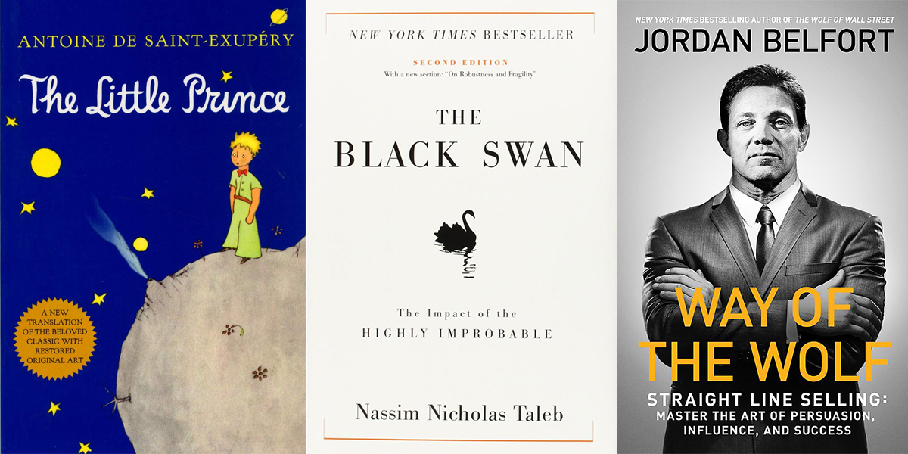
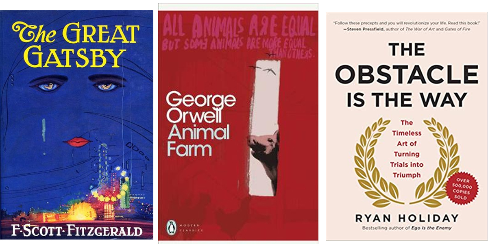
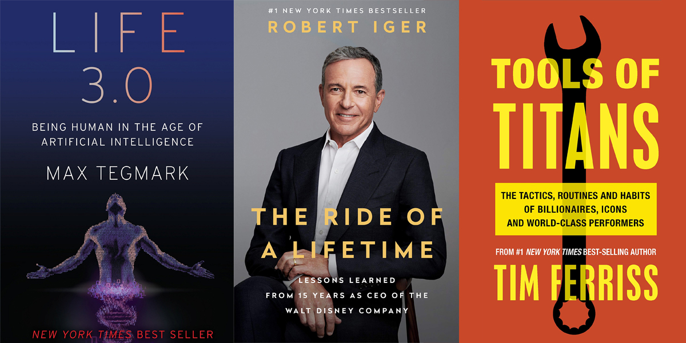
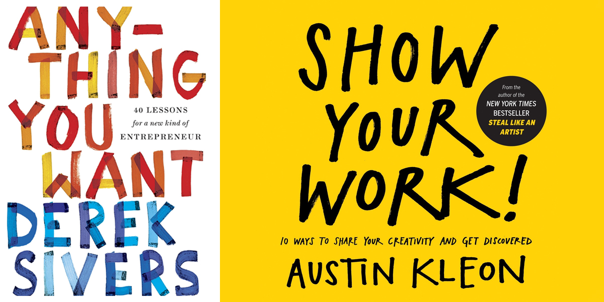
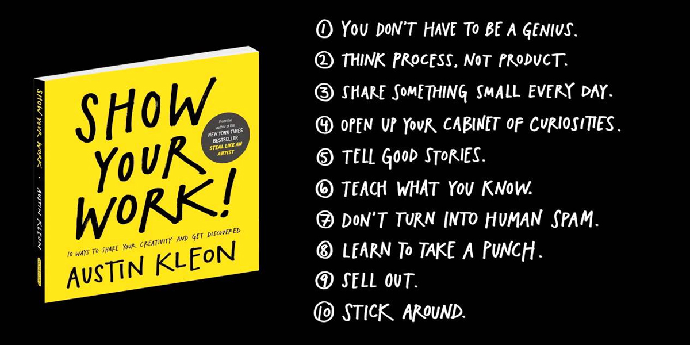

*When a measure becomes a target, it ceases to be a good measure — Goodhart's Law*. Sepertinya gua **kebanyakan** baca buku deh. Don't get me wrong, books are ***awesome***, tapi bulan Agustus lalu sepertinya gua baca buku untuk alasan yang salah. Apakah baca buku banyak == better quality of life? That's not what happened to me. In fact, baca buku malah jadi semacam *mental mastrubation* untuk gua. Ketika gua baca, gua ngerasa oke, berasa semakin pinter, berasa *already figured things out*. Padahal the knowledge and ideas in the books that I read are worthless if I'm not applying that to my life. 

Gua jadi inget salah satu teman gua di FK, sebut saja namanya Olivine, dia baca bukunya Mark Manson, The Subtle Art of Not Giving a Fuck. The book was great, no denying, and she felt that she's enlightened by the art of not giving any singular fuck. But guess what happened few days before she told me how awesome the book is. She didn't give just one fuck (singular), she gave multiple fucks to multiple people and all things happened outside of her control. Olivine, if you're reading this, please know that I really care about your overthinking habit, we know it's setting you back from feeling happy, content, and thinking clearly. There's only one thing you need to do after reading that book... that is to apply the stuffs that Manson taught you.

>*"A journey of a thousand miles begins with one step" — Laozi, (even though the quote is often wrongly attributed to Confucius)*

Sorry kalo gua pake orang lain sebagai contoh, sebenernya gua juga sempet aktif dalam kegiatan *mental mastrubation* pake buku juga. That is until I figured out kalo baca buku is not half of the fight. Reading is not even one step, that's pre-one step. The real one step is when you actually start doing it — day one — first attempt. The real one step is when you do it and start to realize the thing might not be for you, and you are in the verge of giving up — that's the real one step. So even though I read in average around 2 books per week, I figured out: it's not the amount of books that you go through, it is the amount of books that **go through you.** Lagipula dari 11 buku yang gua baca, cuma ada 2 buku doang yang *highly impactful* buat gua. Sisanya ada yang *moderately impactful*, dan ada satu yang ga gua suka. Yang *highly impactful* ini biasanya ketika dia punya cerita hidup yang bisa gua relate, dan dia punya solusi yang mungkin bisa menyelamatkan gua. Buku-buku *highly impactful* tersebut itu ga selalu lo temuin di *recommended shelf* di Books and Beyond atau Amazon. Kadang lo harus nyari bener-bener di Goodreads atau Reddit untuk bener-bener nemu buku yang sesuai sama masalah yang lagi lo hadapin sekarang.

Beberapa buku juga punya *low impact* di hidup gua. Kadang halfway through gua ngerasa agak nyesel bacanya. Beberapa buku itu emang bagus banget bukunya, I was fascinated by the wonders revealed by the book, but it's hard to apply anything I learned from that book to my life. It's safe to say that the book is just not for me, atau mungkin suatu hari nanti gua baru bisa menggunakan pengetahuan yang gua dapet dari buku, for example: pickin up girls by sounding smart thanks to the books that I read, just kidding. Contoh bukunya yang sifatnya kaya gitu adalah Life 3.0 (Max Tegmark), Superintelligence (Nick Bostrom), The Grand Design (Stephen Hawking), dan The God Delusion (Richard Dawkins). Great books and awesome scientific insight, but I can't see myself applying my new knowledge of quantum physics, how electron moves in time-space, and the ethics of General Artificial Intelligence (GAI). Mungkin kalo gua physicist atau AI scientist baru gua ngerasa itu impactful banget.

So let's jump right into the books.

## Little Prince by Antoine de Saint-Exupéry 🤴

Gua tau buku ini dari temen gua—a bookworm, coder girl, a junior in medschool. Awalnya gua kira ini buku bocah yang membosankan gitu. I was totally wrong, tapi iyasih memang buku bocah. Buku ini cerita tentang *Le Petit Prince* yang naif banget dan gatau apa-apa tentang kekuasaan, bisnis, *getting drunk*, geografi, kerja, dan banyak hal lagi yang terjadi sehari-hari di dunia kita. Dia bingung banget kenapa orang-orang mau ngelakuin hal tersebut. Meskipun dia naif dan gatau apa-apa, **but he asked the right questions**.* Gua belajar banyak tentang *asking the right questions* instead of trying to do right things.

## Black Swan by Nassim Nicholas Taleb ⚫🦢

Inilah buku yang gua masukin dalam kategori *high impact* versi gua. Kadang buku ini terkesan kaya glorified version of chaos theory + pareto principle, dengan bumbu-bumbu penemuan Daniel Kahneman (*Thinking, Fast and Slow,* great read). Meskipun begitu buku ini bener-bener nunjukin kalo sebenernya a lot of things in this world is not yet figured out, but **we act like we already did**. Coba pikirin deh, dulu waktu awal-awal covid, orang-orang prediksi ini memang akan lama kelarnya, tapi the so called ilmuwan dari ITB dan FMIPA UI ngepublikasiin prediksi puncak pandemi ini. Coba kita lihat

*“Dari tren yang ada, Pulau Jawa akan mengalami puncak lebih awal, di sekitar akhir Mei dan awal Juni. Ini yang harus diantisipasi dengan penyediaan layanan kesehatan (ICU, ventilator, jumlah tenaga medis, APD dan sebagainya),” ujar Dicky. Sumber: Kompas.com, Jumat (1/5/2020).*

Untuk yang masih waras sampai bulan September ini, pasti ngerti lahya definisi "puncak" itu apa dan gimana kita itu masih jauh dari "puncak". *Still no signs of curve flattening. The so-called experts are wrong—again.* Cuma satu omongan *expert* yang masuk akal, and what he essentially said is that he can't know for sure. Waktu gua baca, ada kebanggaan juga expert tersebut datang dari FKUI yang kucinta (gapenting). *Check out what he says:*

*"Banyak yang membuat prediksi perjalanan wabah di Indonesia. Terus terang prediksi labnya agak sulit sekarang karena penyebabnya multifaktorial," sebut Direktur Lembaga Biologi Molekuler (LBM) Eijkman, Prof Amin Soebandrio. Sumber: Detik.com, Sabtu (28/3/2020).*

He's an expert, he admitted that he can't know for sure, and he's right! No arrogant mathematical simulation. Dan hal kaya beginian itu terjadi berulang-ulang sepanjang sejarah. Prediksi apapun gaakan se akurat itu, dan bahkan bisa jauh banget melenceng dari perkiraan awal. Hal ini karena kita gapernah mempertimbangkan ***Black Swan,*** an unpredictable or unforeseen event, typically one with extreme consequences. Reading this book made me realize such an important thing: we don't know shit, so don't act like it. I can go on ngejelasin semua hal yang keren dari buku ini, tapi that will turn this blog post into a wall of text, and no one likes wall of text. Or do you?

## Way of The Wolf by Jordan Belfort 🐺

Buat yang pernah nonton The Wolf of Wall Street, pasti tau Jordan Belfort. Katanya dia adalah the living legend of the sales world. Some said that he can sell milk to a milkman! Dalam buku ini gua belajar banyak tentang cara dia komunikasi dalam konteks sales pitch sih. Satu hal yang paling penting yang gua dapetin adalah kita gabisa ngejual sesuatu ke orang yang ga lagi *on the market*. The whole point of this book is to turn leads into potential clients, and potential clients to buyers. Not turning *people with no interest* into *buyers*. No rocket science, no scammy techniques, just pure beneficial principles to communicate your product to solve people's pain. 

## The Great Gatsby by F. Scott Fitzgerald 💜

A classic! Read it for enjoyment meskipun gua udan nonton filmnya juga. Great classical read, tapi sekarang gua agak takut kalo gua bakalan sebucin Gatsby. F. Scott Fitzgerald is a genius.

## Animal Farm by George Orwell 🐖

Whooow, finally, the political book! Gua emang udah skip banget politik tapi George Orwell terlalu dewa pemikirannya when it comes to political philosophy. Ini buku cerita tentang binatang-binatang peternakan (babi, kuda, ayam, dll) yang memberontak dan bikin semacam pemerintahan sendiri, no joke, only scary turn of events and mind blowing ending. Ketika gua baca bukunya Orwell, I always experience something I that I know will possibly happen politically, but I never came across Orwell's ideas before. It's always something I've never think about. Great experience.

## Obstacle is The Way by Ryan Holiday 🍁

Gua **gasuka** buku ini. Kaya buku biasa tentang stoicism, cuma cherrypicking ide-ide stoicism yang beredar di orang-orang yang udah terkenal. Lagipula I don't think that the writer, Ryan Holiday, itu cukup experience banyak hal untuk ngomongin tentang stoicism. I don't like books written by charlatan, you have to practice what you preach. Mendingan baca Meditations by Marcus Aurelius, which I already did several years ago. Nyesel bacanya, gua mual pula setelah baca ini.

### ⚠️ Intermezzo ⚠️

Tanggal 3 Agustus gua nulis ini di jurnal gua:

*Gua lagi mual banget; sepertinya karena baca terlalu banyak. Sejak terakhir kali gua nulis di blog gua (nine books I've read in July), gua udah baca 6 buku. 5 Bukunya gua baca di 3 hari pertama di bulan Agustus. Agak terlalu berlebihan, mungkin karena gua taking challenge too seriously: challenge dimana gua harus baca minimal 20 buku dalam satu bulan.*

*Sejauh ini gue udah baca:*

*Little Prince (1 Aug)*, *Black Swan (2 Aug)*, *The Great Gatsby (2 Aug)*, *The Way of The Wolf (2 Aug)*,*Animal Farm (3 Aug)*, *The Obstacle is the Way (3 Aug)*.

Kasian banget ya pake mual segala. That's what happened when I tried to read 5 books in 3 days.

## Life 3.0 by Max Tegmark 🤖

Prologuenya keren banget — hollywood movie script caliber. Bukunya lumayan technical, tapi Max Tegmark bisa ngejelasin General Atrificial Intelligence ke noob seperti saya. Yang gua males adalah dia banyak banget ngejelasin tentang *AI* *ethics*. Not saying that I don't care about ethics

## The Ride of A Lifetime by Robert Iger 🏰

Bill Gates bilang ini salah satu buku yang bisa menggambarkan pengalaman ngejalanin perusahaan dengan baik. Robert Iger itu adalah CEO The Walt Disney Company sejak tahun 2005 sampe sekarang. Lo lihat sekarang Disney bener-bener besar, it owns ESPN, ABC, History, 21st Century Fox, Lucasfilms, dan Marvel Studios. Tapi dulu sebelum kepemimpinannya dia, Disney kacau banget, at least compared to when it first started by Walt Elias Disney himself. Dia punya prinsip yang keren banget tentang kepemimpinan, gua belajar banyak tentang kepercayaan untuk orang yang lu pimpin, supaya yang dia lakuin itu meaningful buat dia. *To not micromanage everything.* I say this book is great, but I can't relate ketika dia cerita tentang masalah-masalah yang terjadi di Disney. Wajar juga, Disney is a big corporation, yaa gua ga relate aja. Tapi the lessons are valuable, coming from one of the most successful CEOs of our generation.

## Tools of Titans by Tim Ferriss 🛠️

This book is like the cheat code of life HAHA. Isinya tentang puluhan *'titans'*, yaitu orang-orang hebat yang pernah hadir di podcastnya Tim Ferriss, yang sharing tentang tips & trik mereka. Bukunya engga deep, tapi bener-bener luas. It is the equivalent to reading 8-9 books, tapi bukunya juga emang tebel banget sih (736 halaman). Gua nemu banyak idola gua di situ, beberapa di antaranya ada Jocko Willink sama Peter Thiel. Tapi setelah baca bagian Peter Thiel, gua jadi merasa buku ini sepertinya rada shallow karena pemikiran besarnya Thiel cuma ditulis jadi 2-3 paragraf gitu. Still worth to read. Gua sampe sekarang masih kadang buka-buka lagi bukunya, siapa tau gua dapet sesuatu yang baru.

## Show Your Work! by Austin Kleon 💼

Ini buku essentially tentang *sharing your work* dan *just start doing it and not worrying about being perfect*. Salah satu alasan gua mulai nulis blog ini juga karna buku ini. Alasan lainnya adalah beberapa dari pembaca pengen gua nulis lagi, terutama artikel tentang buku, karna katanya bisa menginspirasi mereka buat baca. Gua seneng kalo ada yang terinspirasi dari tulisan tentang buku-buku yang gua baca. 

## Anything You Want by Derek Sivers 🎵

Gimana rasanya punya suatu hobi, lalu ga sengaja jadi punya bisnis karna hobi itu, dan ngejual bisnis lo dengan nilai *22 million dollars.* Itulah yang terjadi sama Derek Sivers. Dia mulai perusahaan dia, CD Baby, karna dia mau bantu ngejualin CD lagu band-band teman-temannya. Memang dulu sebelum 1998 industri musik masih dipegang banget sama big record labels, indie music di US kesulitan jualan CD musik mereka. Otomatis, CD Baby ini berkembang banget karna dia bisa jadi wadah untuk indie bands jualan musik mereka. *It's easy to connect the dots in retrospect,* tapi dulu CD Baby itu ya tujuannya cuma jadi bisnis kecil-kecilan Derek Sivers, soalnya kegiatan utamanya dia itu ngeband. Bahkan dia menolak investor yang mau ngeinvest ratus ribuan sampe jutaan dolar, karna dia gamau bisnisnya kegedean! Just like the title, Derek Sivers ngajarin gua kalo bisnis itu ga harus gede, tapi harus sesuai yang lo mau. *Building business is building your perfect world.* I never came across that thought, that's an amazing perspective.

## ⏳ Final Thoughts ⏳

Okay mungkin there's no such thing as *reading too much* as I mentioned earlier. Yang gua masih lack of adalah doing THE THING. Well in my defense sebenernya gua juga terlalu ngejelek-jelekin diri sendiri, I still apply a lot of things after reading sih, but to my standards it was not enough. Cause the books are awesome, but my lack of action makes me no more than doing *mental masturbatory.* It's almost like porn. I might get caught in addiction to reading books. Sebenarnya gua ga cuma baca 11 buku bulan Agustus, masih ada Finding Ultra (high impact, tapi gua belum mau ceritain sekarang), The Grand Design, The God Delusion, How to Get Filthy Rich in Rising Asia (judulnya aneh banget, tapi itu fiction sebenernya), The 4-Hour Workweek, all combined to a total of 16 books. Do the math, it's 4 books per week. With my analogy of the *mental masturbation*, it's like doing porn 4 times a week. But the solution to this is clear, I only need to put more work to actually change my life, instead of reading more while hoping it will change my life. I hope you find some valuable lessons.
